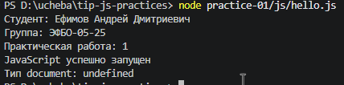
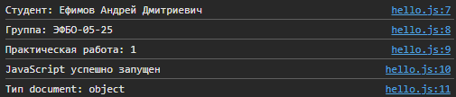
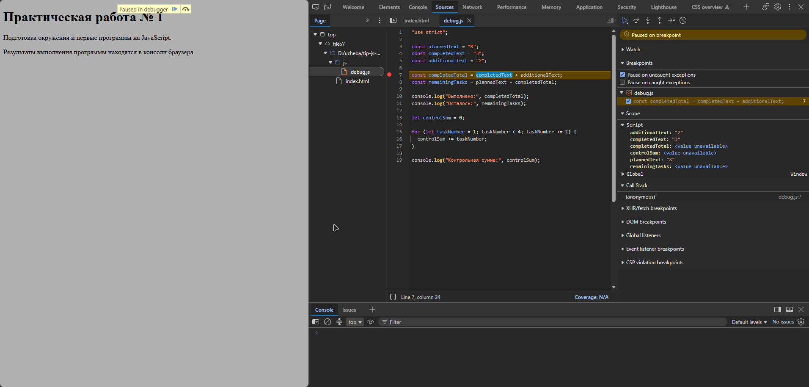

# Практическая работа № 1 — отчёт

## 1. Автор и вариант

- ФИО: Ефимов Андрей Дмитриевич
- Группа: ЭФБО-05-25
- Номер в журнале: 10
- Вариант: ((10 − 1) % 8) + 1 = **2**
- Данные варианта: totalTasks = 15, completedTasks = 0, dailyLimit = 4

## 2. Окружение

- ОС: Windows 11
- Node.js: v24.x.x
- npm: 10.x.x
- Git: 2.4x.x
- Браузер: Chrome 1xx

## 3. Запуск

Из корня `tip-js-practices`:

```bash
node practice-01/js/hello.js
node practice-01/js/types.js
node practice-01/js/progress.js
node practice-01/js/plan.js
node practice-01/js/debug.js
```

### В браузере

1. Открыть `practice-01/index.html` в браузере.
2. В теге `<script>` указать нужный файл, например `./js/types.js`.
3. Сохранить файл и перезагрузить страницу (`F5`).
4. Открыть DevTools (`F12`) → вкладка **Console**.
5. Результаты программы отображаются в Console, а не на самой странице.

## 4. Задание 1. Две среды выполнения

Один и тот же файл `hello.js` был запущен через Node.js и в браузере.





В Node.js DOM отсутствует. В браузере объект document предоставляется средой.

## 5. Задание 2.

| № | Выражение | Ожидание до запуска | Фактическое значение | Тип результата | Объяснение |
|---:|---|---|---|---|---|
| 1 | `"8" + 2` | `"82"` | `"82"` | `string` | Оператор `+` со строкой выполняет конкатенацию: число `2` превращается в `"2"` |
| 2 | `"8" - 2` | `6` | `6` | `number` | Оператор `-` всегда приводит операнды к числу, строка `"8"` → `8` |
| 3 | `Number("8") + 2` | `10` | `10` | `number` | Явное преобразование `Number("8")` даёт `8`, затем арифметическое сложение |
| 4 | `"12" > "3"` | `false` | `false` | `boolean` | Строки сравниваются лексикографически: `"1"` < `"3"`, поэтому `false` |
| 5 | `12 === "12"` | `false` | `false` | `boolean` | Строгое равенство не приводит типы: число ≠ строка |
| 6 | `Number("")` | `0` | `0` | `number` | Пустая строка преобразуется в `0` — опасно для валидации |
| 7 | `Number("text")` | `NaN` | `NaN` | `number` | Нечисловая строка → `NaN`, но `typeof NaN === "number"` |
| 8 | `Boolean("false")` | `true` | `true` | `boolean` | Непустая строка всегда `true`, текст не интерпретируется как логическое значение |
| 9 | `typeof null` | `"object"` | `"object"` | `string` | Историческая особенность JS: `null` — примитив, но `typeof` даёт `"object"` |
| 10 | `typeof NaN` | `"number"` | `"number"` | `string` | `NaN` — специальное числовое значение, поэтому тип `number` |

## 6. Задания 3 и 4. Сводка и план

### Задание 3

| Проверка | Вход (total / done) | Ожидание | Факт | Итог |
|---|---|---|---|---|
| Обычный случай | 12 / 5 | Осталось 7; 41.7%; «В работе» | Осталось 7; 41.7%; «В работе» | Пройдено |
| Нулевые данные | 0 / 0 | «Задач пока нет», без процента | «Задач пока нет» | Пройдено |
| Не начато | 5 / 0 | 0.0%; «Не начато» | 0.0%; «Не начато» | Пройдено |
| Завершено | 5 / 5 | 100.0%; «Завершено» | 100.0%; «Завершено» | Пройдено |
| Выполнено больше | 5 / 6 | `Ошибка: ...` | `Ошибка: недопустимые входные данные` | Пройдено |
| Отрицательное | −1 / 0 | `Ошибка: ...` | `Ошибка: недопустимые входные данные` | Пройдено |
| Дробное | 5 / 2.5 | `Ошибка: ...` | `Ошибка: недопустимые входные данные` | Пройдено |
| Строка вместо числа | "5" / 2 | `Ошибка: ...` | `Ошибка: недопустимые входные данные` | Пройдено |
| Верхняя граница | 1001 / 0 | `Ошибка: ...` | `Ошибка: недопустимые входные данные` | Пройдено |
| NaN | NaN / 0 | `Ошибка: ...` | `Ошибка: недопустимые входные данные` | Пройдено |

### Задание 4

| Проверка | Вход (total / done / limit) | Ожидание | Факт | Итог |
|---|---|---|---|---|
| Обычный случай | 12 / 5 / 3 | 3 дня (3, 3, 1) | 3 дня (3, 3, 1) | Пройдено |
| Ровное деление | 10 / 4 / 3 | 2 дня (3, 3) | 2 дня (3, 3) | Пройдено |
| Лимит больше остатка | 5 / 3 / 10 | 1 день (2) | 1 день (2) | Пройдено |
| Всё выполнено | 5 / 5 / 2 | 0 дней, цикл не запускается | 0 дней | Пройдено |
| Нулевые данные | 0 / 0 / 2 | 0 дней | 0 дней | Пройдено |
| Лимит 0 | 5 / 2 / 0 | `Ошибка: ...` | `Ошибка: недопустимая дневная норма` | Пройдено |
| Дробный лимит | 5 / 2 / 1.5 | `Ошибка: ...` | `Ошибка: недопустимая дневная норма` | Пройдено |
| Выполнено больше | 5 / 6 / 2 | `Ошибка: ...` | `Ошибка: недопустимые данные о задачах` | Пройдено |
| Лимит-строка | 5 / 2 / "2" | `Ошибка: ...` | `Ошибка: недопустимая дневная норма` | Пройдено |
| Лимит > 1000 | 5 / 2 / 1001 | `Ошибка: ...` | `Ошибка: недопустимая дневная норма` | Пройдено |

## 7. Задание 5

### Исходный вывод `debug.js`

```text
Выполнено: 32
Осталось: -24
Контрольная сумма: 6
```

### Итоговый вывод `debug.js`

```text
Выполнено: 5
Осталось: 3
Контрольная сумма: 10
```



| Ошибка | Что наблюдалось | Причина | Исправление | Результат |
|---|---|---|---|---|
| Обработка количества задач | `Выполнено: 32` вместо `5` | Оператор `+` для строк выполнил конкатенацию `"3" + "2" = "32"` | Явное преобразование: `Number(completedText) + Number(additionalText)` | `Выполнено: 5` |
| Граница цикла | `Контрольная сумма: 6` вместо `10` | Условие `taskNumber < 4` прекращает цикл до `4`, суммы 1+2+3 = 6 | Заменено на `taskNumber <= 4` | `Контрольная сумма: 10` |

В ходе выполнения работы освоены:

- запуск одного и того же JavaScript-файла в двух средах — Node.js и браузере — и понимание различий между ними (наличие/отсутствие DOM);
- объявления `const` и `let`, основные типы данных, оператор `typeof`;
- явное преобразование типов через `Number()` и `Boolean()`, строгое сравнение `===`;
- проверка входных данных через `Number.isInteger()` и диапазонные условия;
- организация вычислений через `if / else if / else`;
- цикл `while` с корректной обработкой последней итерации через `Math.min()`;
- отладка через точки останова в Chrome DevTools (панель Sources, шаг с обходом, панель Scope);

Наиболее показательной оказалась ошибка неявного преобразования строк в задании 5. До запуска отладчика казалось, что `"3" + "2"` даст `5`, но на точке останова было видно, что обе переменные имеют тип `string`, а оператор `+` выполнил конкатенацию. Это наглядно показало, почему `typeof` и явное `Number()` важнее, чем визуальное сходство записи.